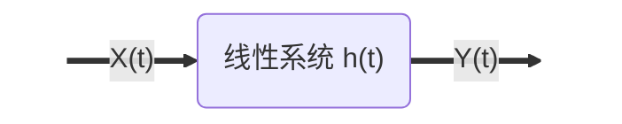

若无特殊说明，本章均考虑平稳过程。

严平稳过程 + 一阶矩、二阶矩均存在 $\Longrightarrow$ 宽平稳

<!--more-->

## 1. 相关函数

- **互相关**：$R_{xy}(\tau)={\mathbb E}[X(t)Y^{\star}(t-\tau)]$
- **自相关**：$R_x(\tau)={\mathbb E}[X(t)X^{\star}(t-\tau)]$
  - 共轭对称性 $R(-\tau)=R^{\star}(\tau)$
  - $R_x(0) \ge |R_x(\tau)|, \tau\in {\mathbb R}$
  - 若 $R(\tau)$ 在 $0$ 处连续，则 $R(\tau)$ 连续
  - 若 $R(\tau)$ 在 $0$ 处可导，则有 $R'(0)=0$
  - 若存在 $\tau_0\ne0$ 使得 $R(\tau_0)=R(0)$，则 $R(\tau)$ 是周期的
  - $R_{xy}^2(\tau) \le {R_{xx}(0) R_{yy}(0)}$
  - $2|R_{xy}(\tau)| \le R_{xx}(0) + R_{yy}(0)$
  - 若 $X,Y$ 独立，$W(t)=X(t)Y(t)$，则 $R_{ww}(\tau)=R_{xx}(\tau)R_{yy}(\tau)$

***栗子 2.1***：$X(t)=a\cos(wt) + b\sin(wt), a,b\sim {\mathcal N}(0,\sigma^2)$，那么可以验证其为宽平稳过程，$R(t_1,t_2)=\sigma^2\cos w(t_1-t_2)$

***栗子 2.2***：AR(1) 模型渐进平稳，MA($q$) 模型平稳。

**性质**：对于实过程的自相关函数，有 $R(0)-R(\tau) \ge \frac{1}{4^n}(R(0)-R(2^n\tau))$。

证明：只需要证明 $R(0)-R(\tau) \ge 1/4 (R(0)-R(2\tau))$，这只需要验证 ${\mathbb E}[(X(t+2\tau)-2X(t+\tau)+X(t))^2]\ge0$ 即可。证毕。

## 2. 功率谱

### 2.1 定义

平稳随机过程的功率谱定义为其自相关函数的傅里叶变换，即
$$
\begin{aligned}
S(w) &= \int R(\tau) e^{-jw\tau} d\tau \\
R(\tau) &= \frac{1}{2\pi}\int S(w)e^{jw\tau} dw
\end{aligned}
$$
特别的，若 $X(t)$ 是实过程，那么 $R(\tau)$ 也是实的偶函数，$S(w)$ 也是实的偶函数，有
$$
\begin{aligned}
S(w) &= \int R(\tau) \cos(w\tau) d\tau \\
R(\tau) &= \frac{1}{2\pi}\int \cos(w\tau) dw
\end{aligned}
$$
定义两个过程 $X(t),Y(t)$ 的**交叉功率谱**为互相关的傅里叶变换，即
$$
\begin{aligned}
S_{xy}(w) &= \int R_{xy}(\tau) e^{-jw\tau} d\tau \\
R_{xy}(\tau) &= \frac{1}{2\pi}\int S_{xy}(w)e^{jw\tau} dw
\end{aligned}
$$

性质：

- 首先由于 $R(\tau)$ 总是共轭对称的，因此可以验证 $S(w)$ 总是实的；
- 功率谱密度总是正的，也就是说 $S(w)\ge0$（注意交叉功率谱没有这个性质）；

上面的第二个性质很符合直观，功率总不能是负的吧；对于确定性信号也很好理解，因为对于确定性信号有 $S(w)=|X(w)|^2$，自然满足。但是对于随机信号不能这做，因为随机信号的一次实现做傅里叶变换是没有意义的，甚至可能不收敛导致本身就无法做傅里叶变换，上面的式子也无从谈起了。

如果从信号处理的角度解释这个问题，不妨假设存在某个点使得 $S(w_0)<0$，由于 $S(w)$ 连续，那么就一定存在一个小的邻域，是的这个区间上都有 $S(w)<0$，对于这样一个信号，如果我们通过一个带通滤波器，得到了输出信号，那么输出信号的功率谱就全是负的，在傅里叶反变换回去就会发现 $R(0)<0$，这显然是不对的。因此总有 $S(w)\ge0$。

### 2.2 功率谱与时域平均

上面将功率谱定义为相关函数的傅里叶变换，那么这种定义是否合理呢？

其实功率谱的定义还有下面这一种，这种定义方式能够自然导出 $S(w)\ge0$ 的性质，也能更好的理解功率谱的概念。

首先定义 $(-T,T)$ 时间段内的**平均随机功率**：
$$
S_T(w) = \frac{1}{2T} \bigg| \int_{-T}^T X(t)e^{-jwt} dt \bigg|
$$
**定理 2.1**：若 $\int_{-\infty}^\infty |\tau R(\tau)|d\tau < \infty$，则 
$$
\lim_{T\to \infty} {\mathbb E}[S_T(w)] = S(w)
$$
证明：略。

## 3. 线性系统

考虑一个线性系统，脉冲响应记为 $h(t)$，频域响应为 $H(w)$

那么我们有 $Y(t)=\int_{-\infty}^{\infty} X(t-a)h(a) da$，对于可实现系统（因果系统），应有 
$$
Y(t)=\int_{0}^{\infty} X(t-a)h(a) da = \int_{-\infty}^t X(a) h(t-a) da
$$
对于输出信号的统计特性

- $R_{yx}(\tau)=R_{xx}(\tau) * h(\tau)$（卷积）
- $R_{yy}(\tau) = R_{xx}(\tau) { \ast } h(\tau) { \ast} h(-\tau)$（卷积）$\Longrightarrow S_{yy}(w) = S_{xx}(w)|H(w)|^2$

根据上面的第一个性质，如果输入信号为白噪声，即 $R_{xx}(\tau) = \sigma^2\delta(\tau)$，那么就有输入信号和输出信号的互相关函数满足 $R_{xy}(\tau)=h(-\tau)\approx \frac{1}{T}\int_0^T X(t+\tau)Y(t)dt$。只考虑因果系统的时候，对于 $\tau>0$ 有 $R_{xy}(\tau)=0$，也就是 $X(t+\tau)$ 与 $Y(t)$ 是正交的，符合直观；对于 $\tau<0$，如果取得 $T$ 足够大，那么我们可以用这个方法来估计系统冲激响应 $h(t)$。

## 4. 随机连续性与随机微积分

确定性函数的连续性定义不能直接应用到随机过程中，并且如果从确定性函数的角度来看，随机过程的任意一个实现很可能就是不连续的，比如泊松过程的轨迹是一个阶梯状的函数。为了将分析的工具应用到随机过程的讨论当中，需要给一个定义，比如绝对值连续、以概率1连续、平均值连续等，但这些定义同样存在一些问题。

### 4.1 随机连续性

我们用的比较多的是**均方连续**，定义为
$$
{\mathbb E}[(X(t+h)-X(t))^2] \to 0 \quad (h\to0)
$$
**推论 2.1**：均方连续 $\Longrightarrow$ 平均值连续。

**定理 2.2**：平稳过程连续 $\iff$ 自相关函数 $R(\tau)$ 在 $\tau=0$ 处连续。

### 4.2 随机微分（均方意义）

**定义**：过程 $X(t)$ 对 $t$ 有均方导数，如果能找到一个过程 $X'(t)$ 满足
$$
\lim_{h\to 0} {\mathbb E}\left[ \frac{X(t+h) - X(t)}{h} - X'(t) \right]^2 = 0
$$
**柯西准则**（实际并不常用）：
$$
\lim_{h_1\to 0,h_2\to0} {\mathbb E}\left[ \frac{X(t+h_1) - X(t)}{h_1} - \frac{X(t+h_2) - X(t)}{h_2} \right]^2 = 0
$$
**定理 2.3**： 平稳过程 $X(t)$，若自相关函数 $R(\tau)$ 具有二阶导数且在 $\tau=0$ 处连续，则在均方意义下可微，反之亦然。

微分运算的一些性质：

1. ${\mathbb E}[X'(t)] = {d {\mathbb E}[X(t)]}/{dt}$；
2. $R_{x'x'}(t_1,t_2) = {\mathbb E}[X'(t_1)X'(t_2)] = \partial^2 R_{xx}(t_1,t_2) / \partial t_1 \partial t_2$；对平稳过程有 $R_{x'x'}(\tau) = -d^2R_{xx}(\tau) / d\tau^2$；
3. ${\mathbb E}[X^{(n)}(t)] = {d^n {\mathbb E}[X(t)]}/{dt^n}$；
4. $R_{x^{(n)}y^{(m)}}(t_1,t_2) = {\mathbb E}[X^{(n)}(t_1)Y^{(m)}(t_2)] = \partial^{n+m} R_{xy}(t_1,t_2) / \partial t_1^n \partial t_2^m$；对平稳过程有 $R_{x^{(n)}y^{(m)}}(\tau) = (-1)^m d^{m+n}R_{xy}(\tau) / d\tau^{m+n}$。

### 4.3 Taylor 级数

**定理 2.4**：平稳过程 $X(t)$，若 $R(\tau)$ 是解析的，即存在无穷阶导数，且满足 $R(\tau) = \sum_{n=0}^{\infty} R^{(n)}(0) \tau^n/n!$，则 $X(t)$ 可以展开成 Taylor 级数
$$
X(t+h) = \sum_{n=0}^{\infty} X^{(n)}(t) \frac{h^n}{n!}
$$
**注**：这个式子很难应用，因为导数 $X^{(n)}(t)$ 不好计算；不过根据这个式子，可以理解为把 $X(t+h)$ 投影到多项式基底上。

### 4.4 随机微分方程

对于随机微分方程 $a_n Y^{(n)}(t) + a_{n-1} Y^{(n-1)}(t) + \cdots + a_0 Y(t) = 0$，先求均值/自相关，然后按确定性函数求解。

### 4.5 随机积分

略。

## 5. 遍历性

我们将随机过程看作每一个时刻都是一个随机变量 $X(t)$，但是问题是时间是不停流逝的，对于某个时刻的随机变量我们可能只能获得一个采样，那么怎么去获得其统计特性呢？这个时候就需要引入遍历性这一概念。

如果一个随机过程的**某个统计量**的时间平均等于总体平均，那么称这个统计量具有**遍历性**。

### 5.1 均值的遍历性

**定理 2.5**：给定平稳过程 $X(t)$，其时间平均 $\lim_{T\to\infty} \frac{1}{2T}\int_{-T}^{T}X(t) dt = {\mathbb E}[X(t)]=\eta$ 的**充要条件**是
$$
\begin{aligned}
\lim_{T\to\infty}\int_0^{2T} (1-\frac{\tau}{2T})[R(\tau)-\eta^2] d\tau = 0 \\
\iff \lim_{T\to\infty} \frac{1}{2T}\int_{-T}^T R(\tau) d\tau = \eta^2
\end{aligned}
$$
注：上面两个判断条件数学上完全等价， 第一个相当于加了三角窗，实际当中王王只存在有限个样本，因此采用加窗的方法更好。

**推论 2.5.1**：给定实平稳过程 $X(t)$，记 $C(\tau)=R(\tau)-\eta^2$

1. 若 $\int_0^\infty C(\tau d\tau) < \infty$，则 $X(t)$ 为均值遍历的；
2. 若 $\lim_{\tau\to\infty} C(\tau)=0$，则 $X(t)$ 为均值遍历的。

证明：只需要得到 $R(\tau)\to \eta^2 ~ (\tau\to\infty)$，略。

### 5.2 自相关的遍历性

首先回顾自相关的定义 $R(\tau) = {\mathbb E}[X(t+\tau)X^{\star}(t)]$，那么实际上中我们只有每个时刻的采样值，用这些采样值相乘得到的所谓的“自相关”其实也是一个随机变量，可以定义为 $Z_{\tau}(t) = X(t+\tau)X^{\star}(t)$，那么 $Z_\tau(t)$ 的时间平均是否等于其期望值呢？其时间平均可以定义为 $R_T(\tau) = \frac{1}{2T}\int_{-T}^{T} Z(t) dt = \frac{1}{2T}\int_{-T}^{T} X(t+\tau)X^{\star}(t) dt$，显然有其均值为 ${\mathbb E}[R_T(\tau)] = R(\tau)$，自相关为 
$$
R_{zz}(\lambda) = {\mathbb E}[ X(t+\tau+\lambda)X^{\star}(t+\lambda) X^{\star}(t+\tau)X(t) ]
$$
**定理 2.6**：对于给定的 $\tau$，时间平均等于期望，即 $\lim_{T\to\infty} \int_{-T}^T X(t+\tau)X^{\star}(t)dt = {\mathbb E}[X(t+\tau)X^{\star}(t)] = R(\tau)$，的**充要条件**是
$$
\lim_{T\to\infty} \frac{1}{T} _0^{2T}(1-\frac{\tau}{2T})[R_{zz}(\lambda) - R^{2}(\tau)] = 0
$$

### 5.3 分布函数的遍历性

随机变量的一阶分布函数定义为 $F(x) = P(X(t)\le x)$，（不严谨的说）分布函数和随机变量是一一对应的，也就是两者可以认为是同一件事物的两种等价定义。那么如何研究分布函数的遍历性呢？就把它也转换成一个随机变量，定义一个新的过程。

假定 $x$ 为固定常数，定义
$$
Y(t) = \begin{cases}
1,& X(t)\le x \\
0,& X(t) > x
\end{cases}
$$
其平均值为 ${\mathbb E}[Y(t)] = P(X(t)\le x)$，自相关为 ${\mathbb E}[Y(t+\tau)Y^{\star}(t)] = P(X(t+\tau)\le x), X(t\le x) = F(x,x ; \tau)$，这里 $F(x_1,x_2;\tau)$ 是 $X(t)$ 的二阶分布。类似前面两小节，其时间平均等于总体平均的充要条件是什么呢？

**定理 2.7**：对于给定的 $x$，$\lim_{T\to\infty}\frac{1}{2T}\int_{-T}^{T} Y(t) dt = F(x)$ 成立的**充要条件**是
$$
\lim_{T\to\infty}\frac{1}{2T}\int_{0}^{2T} (1-\frac{\tau}{2T}) [F(x,x;\tau) - F^2(x)] dt = 0
$$

> **注**：从遍历性讨论得知，假如 $X(t)$ 具有遍历性，如果 $\lim_{\tau\to\infty} R(\tau)$ 存在，那么有 $\lim_{\tau\to\infty} R(\tau) = \eta^2$，这表明随着 $\tau$ 的增加，$X(t+\tau)$ 与 $X(t)$ 的相关性减弱，特别的，在 $\tau\to\infty$ 时，随机变量 $X(t+\tau)$ 与 $X(t)$ 不相关。
>
> 对于分布函数的遍历性而言，有 $\lim_{\tau\to\infty} F(x,x;\tau) = F^2(x)$，也就是 $\tau\to\infty$ 时 $X(t+\tau)$ 与 $X(t)$ 相互独立。

## 6. 抽样定理与随机预测

### 6.1 随机过程抽样定理

抽样定理描述了连续随机过程和离散随机过程自相关函数之间的关系。首先定义一个过程 $X(t)$ 为低通的，若其功率谱 $S(w)$ 满足 $S(w=0),\forall |w|>w_c$。

**定理 2.8**：对于带限过程 $X(t)$，有（$T=\pi/w_c$）
$$
R(\tau) = \sum_{n=-\infty}^{\infty} R(nT) \frac{\sin(w_ct - n\pi)}{w_c t- n\pi}
$$
注：这从信号与系统的角度很好理解，$X(nT)$ 是对 $X(\tau)$ 做了周期采样，因此其频谱是后者的周期延拓，由于连续信号的频谱是低通带限的，因此要想用 $X(nT)$ 恢复出 $X(\tau)$，就要加一个低通矩形窗，这在时域就表现为与 Sa 脉冲做卷积。

**定理 2.9（抽样定理）**：对于带限过程 $X(t)$，有（$T=\pi/w_c$）
$$
X(t) = \sum_{n=-\infty}^{\infty} X(nT) \frac{\sin(w_ct - n\pi)}{w_c t- n\pi}
$$
证明：略。

注：这个定理跟上一个有略微的不同，上一个是自相关函数，实际上已经没有随机性，可以直接用以前的信号与系统的观点来看。但是这里的 $X(t),X(nT)$ 都是随机变量，实际上这里可以理解为 $X(t)$ 可以表示为 $X(nT)$ 的线性组合，所以我们可以用采样值重构原始过程。信号处理方面，我们则可以使用截断的抽样定理公式来重构信号。

### 6.2 随机预测

这部分举个栗子。考虑对 $X(t)$ 构造过程
$$
\hat{X}_n(t) = \tbinom{n}{1}X(t-T_1) - \tbinom{n}{2}X(t-2T_1) + \cdots + (-1)^{n-1}X(t-nT_1)
$$
那么 $Y(t) = X(t)-\hat{X}_n(t)$ 的功率谱为 $S_{yy}(w) = S_{xx}(w)(2\sin \frac{wT}{2})^{2n}$，于是有 ${\mathbb E}[(X(t)-\hat{X}_n(t))^2]\to 0 ~ (n\to\infty)$。